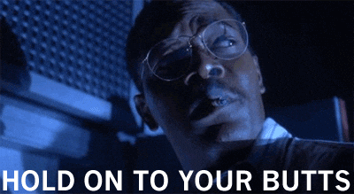
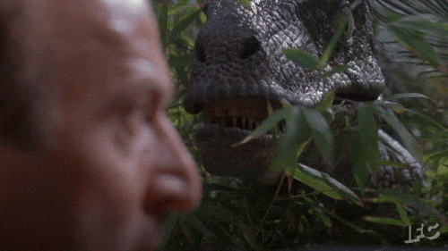
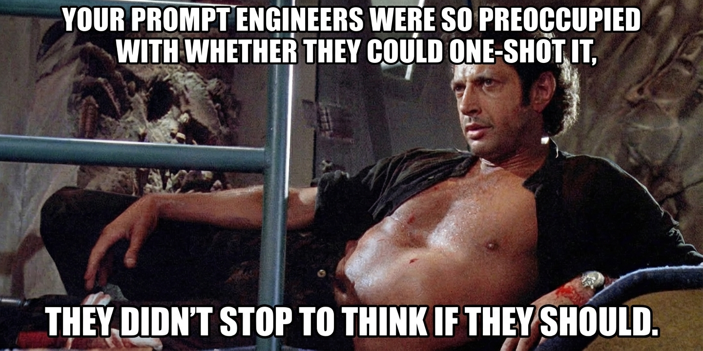

# My Claude Code Workflow

## TL;DR

**The workflow in one line:** Discussion → Plan → Review → Best-idea → Improve → Implement → Code-review

If you just want the skills, [download them here] and start using them today. The rest of this post explains why each phase exists and what breaks when you skip it.

| Phase | What happens | Why it matters | Artifact |
|-------|--------------|----------------|----------|
| Discussion | Claude asks questions one at a time until ready to plan | Forces decisions upfront instead of assumptions | Decisions list |
| Plan | Claude writes exhaustive implementation plan (Opus, the deeper model) | The plan becomes the artifact you'll review and execute | `~/.claude/plans/` |
| Handoff | Break large plans into agent-sized task files | Parallel execution, clear dependencies | Task files |
| Plan-review | Fresh context reviews plan for gaps | Catches issues before they become bugs | Findings list |
| Best-idea | Research alternatives when uncertain | Finds Option D when you're stuck on A, B, C | Recommendation |
| Improve-idea | Simplify, strengthen, "wouldn't it be cool if" | B+ plans become A- plans | Suggestions list |
| Implement | Sub-agents execute in parallel | Trust the plan, context-switch to other work | Commits |
| Code-review | Fresh context reviews commits | Catches what slipped through | Review notes |

---

## Introduction

I think out loud. Claude writes plans. We merge until the bugs are caught before they exist. The code is almost an afterthought. And somewhere in the discussion, ideas surface that I never would have prompted for.

The upfront investment is real. But it pays back in code that doesn't need to be rewritten.

This post took [X] sessions using the exact workflow I'm about to describe. If you want to skip the story and start using this yourself, grab the skill files above. But if you want to understand why each phase exists, keep reading.

I could walk you through each phase with bullet points. Instead, let's talk about dinosaurs.

*(If you don't like fun, there's a "no dinos" toggle just for you.)*

---

## The Scene Opens

John Hammond has a vision. He's spent years bringing dinosaurs back to life, and now he needs a plan to open the park to the public. He's confident. He's "spared no expense." He just needs Claude to tighten things up.

Hammond's opening prompt:

> I've attached the full park documentation: containment systems, tour design, staffing, and operations. We've spared no expense on planning. Just need a fresh set of eyes before we announce to investors. Ask me questions one at a time until we're ready to finalize the implementation plan.

---

**[KEVIN]**

The common advice is "start in plan mode." Even the Claude Code team recommends it. But plan mode is still rushing toward a plan; it might ask a question or two, then it's off to the races.

Instead I just write up what problem I am trying to solve and end it with:

`Ask me questions one at a time until you're ready to write a plan.`

No special prompt. Claude stops trying to solve immediately and starts asking questions. Once we've actually talked it through, then I drop into plan mode to write it up.

Skip this step and life, uh, finds a way... of punishing you later.

---

## Phase 1: Discussion

[PHASE: DISCUSSION]

Hammond has shared his documentation. Containment systems, tour design, staffing plans, the investor deck. Claude has read everything.

---

**Claude:**

I've reviewed the documentation. Strong vision, and the technical specs are more detailed than most projects I see at this stage. Before I write the implementation plan, I need to clarify a few things.

First question: What's the core guest experience you're optimizing for?

I see three possible framings in your materials:

1. **Educational** - The investor deck emphasizes "real science" and "witnessing evolution." Longer exhibit times, interpretive signage, guided tours with paleontologists.

2. **Spectacle** - The tour route prioritizes dramatic reveals. The T-Rex paddock is positioned for maximum impact. You're optimizing for awe over information.

3. **Adventure** - Some containment language implies controlled danger as a feature. "Experience creatures that ruled the earth." Different safety calculus.

Which framing should I prioritize when decisions conflict?

**Hammond:**

Spectacle, absolutely. I want a child to look up at a Brachiosaurus and forget that extinction was ever a thing. Wonder is what they're paying for.

**Claude:**

That clarifies several things in your tour design. The vehicle pacing makes sense now; you're controlling the reveal timing, not just moving people through efficiently.

Next question...

---

*Discussion continued, covering power redundancy, raptor behavior reports, guest evacuation routes, veterinary staffing, and why one IT employee seemed to have credentials for every critical system.*

---

**Claude:**

I have enough to draft the plan. Here's what we've decided:

- Spectacle-first guest experience, science as supporting credibility
- Tour pacing optimized for dramatic reveals, not throughput
- Species separation to reduce predator-prey stress
- Veterinary facilities scaled for current population plus 20% growth
- Visitor center positioned as emergency centralization point
- "Kids love dinosaurs" confirmed as core marketing thesis

Anything else before I write this up?

**Hammond:**

I think that covers everything. We've spared no expense.

**Claude:**

Ready for the plan.

---

**[KEVIN]**

Once Claude runs out of questions, I switch to plan mode. Instead of accepting the plan to begin implementation I run:

`/handoff`

This creates a folder in `docs/`, splitting up the plan into task files scoped for smaller agents like Sonnet *(faster, cheaper, and they don't need the whole picture)*, plus a README with the high-level view.

---

## Phase 2: Plan Review

[PHASE: PLAN-REVIEW]

Once the planning documents have been created, I clear the context and run:

`/plan-review docs/[plan-name]`

This reviewer doesn't remember you talking yourself into "it'll probably be fine." It just sees the plan and asks: does this actually make sense?

---

## Plan Review: Jurassic Park Implementation Plan

### Summary

Ambitious vision with solid containment specs and clear guest experience priorities. The main risks are infrastructure interdependencies: unified power systems and concentrated IT access create correlated failure modes.

---

### Findings

#### CRITICAL (Blocks Implementation)

**1. Single Point of Failure: Power Systems**
- **Problem:** Main power grid and diesel backup share infrastructure. A tropical storm that damages primary power could simultaneously flood the generator building.
- **Impact:** All electric fencing fails simultaneously across every paddock.

**2. Single Point of Failure: IT Access**
- **Problem:** One employee (Nedry) holds system-wide credentials across security, containment, communications, and life support.
- **Impact:** Disgruntled employee, compromised account, or simple human error could disable all systems simultaneously.

---

#### HIGH (Significant Risk)

**3. Raptor Containment Designed for Wrong Threat Model**
- **Problem:** Current containment (12-foot fences, standard feeding) treats raptors as physical threats. Field observations suggest cognitive threats: systematic fence testing, pattern learning, coordinated behavior.
- **Impact:** Fence height becomes irrelevant if they're probing for weaknesses, not trying to jump.

---

#### MEDIUM (Should Address)

**4. Viewing Areas at Ground Level**
- **Problem:** T-Rex and raptor paddocks have ground-level viewing platforms.
- **Impact:** Guests within reach if barrier fails.

---

*Plus 4 additional findings covering guest evacuation, tour vehicle overrides, behavioral monitoring, and breeding controls.*

---

### What the Plan Gets Right

- Spectacle-first experience with clear priority hierarchy
- Species separation prevents predator-prey stress
- Visitor center positioned for emergency centralization

---

### Questions Requiring Clarification

1. What's Nedry's compensation relative to market rate?
2. What is the latching mechanism on interior doors?
3. Has the all-female population been independently verified?

---

Ready to walk through findings. Say "go" to start one-at-a-time review.

---

---

## Findings Resolution

[PHASE: PLAN-REVIEW continued]

**Hammond:** Go.

---

**Claude:**

Categorizing findings:

**Autosolve (≥90% confidence):** 6 findings
- Power Systems: Underground backup generator, physically separated from operations
- IT Access: Role separation plus market-rate adjustment for Nedry, since concentrated access and underpayment is a flight risk
- Guest Evacuation: Zone-based bunkers every 500m, because "return to visitor center" assumes you can
- Tour Vehicles: Auto-unlock on power loss, so guests aren't served adjacent to the T-Rex
- Behavioral Monitoring: Hire an ethologist, someone should notice if the animals are planning something
- Breeding Controls: Ecosystem audit for alternative lysine sources, since life finds a way

**[KEVIN]**

Six findings, autosolved. This is the part where people ask "why not just let Claude do everything?" Because the two it couldn't autosolve catch you mid-climb when the power kicks back on.

**Discussion (<90%):** 2 findings
- Finding 3: Raptor Containment
- Finding 4: Viewing Areas

Starting with Finding 4.

---

### Finding 4: Viewing Areas (MEDIUM)

**Problem:** T-Rex and raptor paddocks have ground-level viewing platforms. Guests within reach if barrier fails.

**Option A: Fully elevated platforms (20+ feet)**
- Maximum safety margin, eliminates ground-level failure mode

**Option B: Elevated with open-air design**
- Maintains spectacle while adding safety margin

Recommended: Option A (88% confidence). Eliminates the failure mode entirely. Still provides dramatic views.

**Hammond:** No. Option B.

The whole point is feeling the ground shake when the T-Rex walks. You can't experience that through twenty feet of steel scaffolding. We need elevation for safety, but the experience has to stay visceral. Open air, close enough to feel it.

**Claude:** Understood. Spectacle as primary driver; I should have weighted it higher. I can design elevated platforms with rapid-descent emergency exits built in. Guests get the immersive experience during normal operation, but can drop to bunker level in under 30 seconds if containment fails. Safety infrastructure stays invisible until needed.

Moving to Finding 3.

---

**[KEVIN]**

Plan-review surfaces findings, and Claude gives options in tiers (usually simple to complex, or safe to aggressive). Its recommendations are reasonable given what it knows. But it doesn't know everything.

It might suggest skipping a feature to reduce complexity, but I know users have been asking for it for months. Or it recommends the robust solution when I just need something working by Friday.

This happens constantly. Claude optimizes for what it can see. You fill in what it can't.

---

### Finding 3: Raptor Containment (HIGH)

**Problem:** Current containment treats raptors as physical threats. Field observations suggest cognitive threats: systematic fence testing, pattern learning, coordinated behavior.

**Option A: Increase physical barriers**
- Higher fences, added moat. Addresses symptoms, not cause.

**Option B: Behavioral countermeasures**
- Randomized feeding, multiple barrier types, elevated-only access. Addresses cognitive threat model.

**Option C: Commission behavioral assessment first**
- Understand what we're containing before finalizing design.

Recommended: Option B (72% confidence). Physical barriers assume they're trying to overpower containment. If they're probing for weaknesses instead, unpredictability matters more than height.

But confidence is low. I don't have hard data on raptor capabilities. How high can they jump? Can they climb? How coordinated is pack behavior?

**Hammond:** /best-idea What about a moat system combined with randomized feeding? The field reports mention they avoid water.

---

## Phase 3: Best Idea

[PHASE: BEST-IDEA]

**[KEVIN]**

`/best-idea` is for when findings aren't clear, or you have an inkling there's a better way.

Run the command with your half-formed thought. Claude does extra research and either confirms its recommendation or finds something it completely missed: a package that already solves it, a simpler structure, the thing you were overcomplicating.

---

## Best-Idea Evaluation: Raptor Containment

### Research Summary

After reviewing paleontological behavior studies, modern apex predator containment standards, and field incident reports:

**Key findings about Velociraptors:**

1. **Problem-solving intelligence comparable to primates.** They don't just react; they experiment. Systematic fence testing is consistent with cognitive mapping behavior seen in great apes.

2. **Can jump 10+ feet vertically from standing.** 12-foot fences provide less than 2 feet of margin.

3. **Test barriers systematically and remember weak points.** They return to the same sections because they're tracking results over time.

4. **Learn from observation.** Field reports note they watch handlers during feeding. Not tracking food. Studying process.

**Current plan gap:** Treats raptors as physical threats requiring physical barriers. Doesn't account for cognitive capabilities.

---

### Hammond's Hypothesis Evaluated

**Moat system + randomized feeding**

The instinct is partially right:
- Moats provide a barrier that works without power
- Randomization prevents pattern learning
- Water aversion is real

But incomplete. Moat alone doesn't address climbing or jumping. Randomized feeding doesn't help if they're also learning handler schedules, patrol routes, gate procedures.

Higher fences and electrified ceilings have the same problem: they assume physical containment is enough. If they're probing for weaknesses, single barriers of any type are insufficient.

---

### Recommendation

**Multi-layer containment with behavioral countermeasures** (87% confidence)

- Outer fence: 24-foot, angled inward at top
- Inner fence: Separate power system from main grid
- Moat between fences: Leverages water aversion, works without power
- Randomized feeding: Locations AND schedules vary
- Randomized patrol routes: Predictable security is exploitable security
- Double-airlock entry: No direct human access to enclosure, ever

Hammond's moat instinct was right, but it needs to be part of a layered system. The key insight isn't height or voltage. It's that **they're testing you as much as you're containing them.**

---

**Hammond:** They remember weak points? They watch handlers?

**Claude:** They return to the same fence sections repeatedly. They're not testing randomly; they're running experiments. And during feeding, they track handler movements rather than just the food. Your containment staff are being studied.

---

Full best-idea prompt

[Collapsible content: best-idea prompt goes here]

---

## Phase 4: Improve Idea

[PHASE: IMPROVE-IDEA]

**[KEVIN]**

`/improve-idea` asks three questions: What can we simplify? What should we strengthen? And "wouldn't it be cool if..."

The wild ideas aren't always practical, but sometimes they're exactly what the project needs. They can also just be fun, and what takes a B plan to an A.

---

## Idea Improvement: Jurassic Park Implementation Plan

---

### 1. Simplify

**Single "lockdown" command**
Currently requires per-paddock activation. One command triggers all containment protocols simultaneously.

---

### 2. Strengthen

**Puzzle feeders for raptors**
Mental stimulation reduces escape motivation. Bored apex predators find their own entertainment. Give them problems to solve that aren't "how do I get out."

**Environmental enrichment for T-Rex paddock**
Currently barren. One goat on a chain isn't enrichment. Varied terrain, hunting simulations, environmental complexity. Recommend starting with a big red ball.

---

### 3. Stretch

**Gallimimus stampede experience**
Guests stand in designated "safe zone" while the herd thunders past during feeding time. High spectacle, moderate risk.

**Compy petting zoo**
They're small. How dangerous could they be? Family-friendly, high engagement.

**Dinosaur dung exhibit**
Educational value. Dr. Sattler approved. Gift shop sells bags for home gardens.

---

**Hammond:** The compy petting zoo. I love those little guys. Had one nibble at me once. Are we sure they're safe?

**Claude:** Researching... Only two reported cases of compys inflicting life-threatening injuries.

---

Full improve-idea prompt

[Collapsible content: improve-idea prompt goes here]

---

## Implementation

[PHASE: IMPLEMENTATION]

**[KEVIN]**

Once the plan is solid, clear context and run `/start-implementation`. Sub-agents spin up in parallel, each working from its task file, no context bleed between them.

I set it running and context-switch to other work. Come back when it's done. (Assuming you've set up the permissions. Ask me how I learned that.)

---

## Phase 5: Code Review

[PHASE: CODE-REVIEW]

**[KEVIN]**

After implementation, clear context and run `/code-review`. It catches the gap between what the plan said and what got built.

The agent that implemented knew the intent. A fresh reviewer just sees code. Most findings are syntax or type errors, but you'll be surprised how often it catches a wrong assumption or a cleaner way to do something.

---

## Code Review: Jurassic Park Implementation

### Finding 1 (MEDIUM): Autosolve

**Location:** Kitchen, Visitor Center

**Problem:** Standard door handles installed throughout facility.

**Why this matters:** If any animal demonstrates the ability to operate lever-style handles, every interior door becomes a breach point.

**Fix:** Replace with round knobs or push-bar mechanisms.

---

### Finding 2 (CRITICAL)

**Pattern:** Single point of failure in critical systems staffing

**Problem:** New role-based access controls have been added, but existing credentials were left unchanged. Nedry still has system-wide access across security, containment, communications, and life support.

Additionally: compensation data shows Nedry at 15% below market rate for his role. Concentrated access plus underpayment is a flight risk.

**Option A: Retention package**
- Immediate salary adjustment to market rate, reduces flight risk

**Option B: Redundancy**
- Hire second systems engineer, implement credential handoff

**Option C: Both (Recommended)**
- Address motivation and eliminate single point of failure

Recommended: Option C (95% confidence). The fences don't matter if the person controlling them has a better offer.

---

Full code-review prompt

[Collapsible content: code-review prompt goes here]

---

## Outro

That's the workflow. Discussion → plan → review → best-idea → improve → implement → code-review.

Claude can one-shot most things. But one-shotting isn't the ceiling. It's the floor. When you take the time to discuss each piece, push back on recommendations, and review with fresh eyes, you're not just using Claude. You're combining what you know with what Claude knows.

Claude sees patterns across millions of codebases. You see the user who's been asking for that feature for six months. Neither perspective is complete. The workflow exists to collide them.

The hours of upfront discussion feel slow. Turns out, they pay back in code that doesn't need to be rewritten.

Skip the workflow and: Developer writes prompt. Prompt creates AI agent. AI agent writes code. Code breaks production. Tech debt inherits the earth.

---

Hammond's original plan would have worked perfectly, assuming nothing went wrong. This workflow exists because things go wrong, and the best time to find that out is before you've written a single line of code.

---

## Download the Skills

[Download links for skill files]

- plan-review.md
- best-idea.md
- improve-idea.md
- code-review.md
- start-implementation.md
